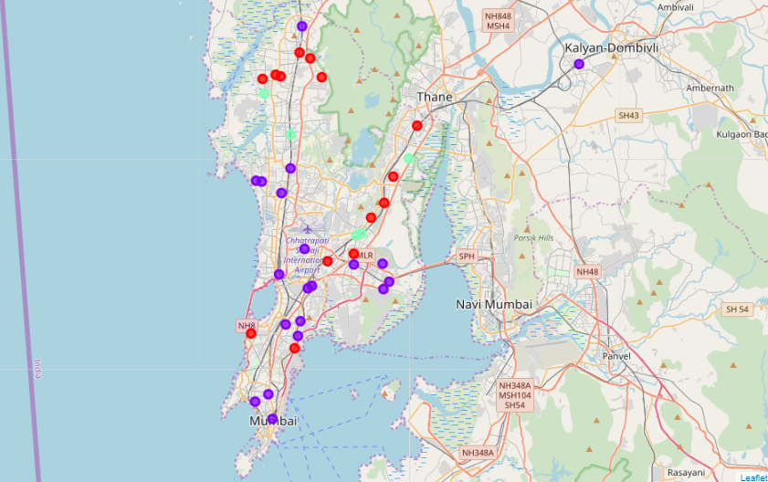

# Coursera Capstone 
## IBM Applied Data Science Capstone 
 
### Opening a New Shopping Mall in Mumbai 
 

# Introduction 
For many shoppers, visiting shopping malls is a great way to relax and enjoy themselves during weekends and holidays. They can do grocery shopping, dine at restaurants, shop at the various fashion outlets, watch movies and perform many more activities. Shopping malls are like a one-stop destination for all types of shoppers. For retailers, the central location and the large crowd at the shopping malls provides a great distribution channel to market their products and services. Property developers are also taking advantage of this trend to build more shopping malls to cater to the demand. As a result, there are many shopping malls in the Mumbai and many more are being built. Opening shopping malls allows property developers to earn consistent rental income.  Of course, as with any business decision, opening a new shopping mall requires serious consideration and is a lot more complicated than it seems. Particularly, the location of the shopping mall is one of the most important decisions that will determine whether the mall will be a success or a failure.  

# Business Problem 
The objective of this capstone project is to analyse and select the best locations in Mumbai to open a new shopping mall. Using data science methodology and machine learning techniques like clustering, this project aims to provide solutions to answer the business question: In Mumbai city , if a property developer is looking to open a new shopping mall, where would you recommend that they open it?
 
# Target Audience of this project 
This project is particularly useful to property developers and investors looking to open or invest in new shopping malls in the capital city of Maharashtra i.e. Mumbai.

# Data 
## To solve the problem, we will need the following data: 
- List of neighbourhoods in Mumbai. This defines the scope of this project which is confined to the city of Mumbai, the capital city of the Maharashtra state.
- Latitude and longitude coordinates of those neighbourhoods. This is required in order to
plot the map and also to get the venue data. 
- Venue data, particularly data related to shopping malls. We will use this data to perform
clustering on the neighbourhoods. 
 
## Sources of data and methods to extract them 
This Wikipedia page (https://en.wikipedia.org/wiki/Category:Suburbs_of_Mumbai) contains a list of neighbourhoods in Mumbai, with a total of 40 neighbourhoods. We will use web scraping techniques to extract the data from the Wikipedia page, with the help of Python requests and beautifulsoup packages. Then we will get the geographical coordinates of the neighbourhoods using Python Geocoder package which will give us the latitude and longitude coordinates of the neighbourhoods.  

After that, we will use Foursquare API to get the venue data for those neighbourhoods. Foursquare has one of the largest database of 105+ million places and is used by over 125,000 developers. Foursquare API will provide many categories of the venue data, we are particularly interested in the Shopping Mall category in order to help us to solve the business problem put forward. This is a project that will make use of many data science skills, from web scraping (Wikipedia), working with API (Foursquare), data cleaning, data wrangling, to machine learning (K-means clustering) and map visualization (Folium). In the next section, we will  present the Methodology section where we will discuss the steps taken in this project, the data analysis that we did and the machine learning technique that was used.

# Methodology 
Firstly, we need to get the list of neighbourhoods in the city of Mumbai. Fortunately, the list is available in the Wikipedia page (https://en.wikipedia.org/wiki/Category:Suburbs_of_Mumbai). We will do web scraping using Python requests and beautifulsoup packages to extract the list of neighbourhoods data. However, this is just a list of names. We need to get the geographical coordinates in the form of latitude and longitude in order to be able to use Foursquare API. To do so, we will use the wonderful Geocoder package that will allow us to convert address into geographical coordinates in the form of latitude and longitude. After gathering the data, we will populate the data into a pandas DataFrame and then visualize the neighbourhoods in a map using Folium package. This allows us to perform a sanity check to make sure that the geographical coordinates data returned by Geocoder are correctly plotted in the city of Mumbai. 

Next, we will use Foursquare API to get the top 100 venues that are within a radius of 3000 meters. We need to register a Foursquare Developer Account in order to obtain the Foursquare ID and Foursquare secret key. We then make API calls to Foursquare passing in the geographical
coordinates of the neighbourhoods in a Python loop. Foursquare will return the venue data in JSON format and we will extract the venue name, venue category, venue latitude and longitude. With the data, we can check how many venues were returned for each neighbourhood and examine how many unique categories can be curated from all the returned venues. Then, we will analyse each neighbourhood by grouping the rows by neighbourhood and taking the mean of the frequency of occurrence of each venue category. By doing so, we are also preparing the data for use in clustering. Since we are analysing the "Shopping Mall" data, we will filter the "Shopping Mall" as venue category for the neighbourhoods.

Lastly, we will perform clustering on the data by using k-means clustering. K-means clustering algorithm identifies k number of centroids, and then allocates every data point to the nearest cluster, while keeping the centroids as small as possible. It is one of the simplest and popular unsupervised machine learning algorithms and is particularly suited to solve the problem for this project. We will cluster the neighbourhoods into 3 clusters based on their frequency of occurrence for "Shopping Mall". The results will allow us to identify which neighbourhoods have higher concentration of shopping malls while which neighbourhoods have fewer number of shopping malls. Based on the occurrence of shopping malls in different neighbourhoods, it will help us to answer the question as to which neighbourhoods are most suitable to open new shopping malls. 
 
# Results 
The results from the k-means clustering show that we can categorize the neighbourhoods into 3 clusters based on the frequency of occurrence for "Shopping Mall": 
- Cluster 0: Neighbourhoods with moderate number of shopping malls
- Cluster 1: Neighbourhoods with high concentration of shopping malls 
- Cluster 2: Neighbourhoods with low number to no existence of shopping malls
The results of the clustering are visualized in the map below with cluster 0 in red colour, cluster 1 in purple colour, and cluster 2 in mint green colour.

# Discussion 
As observations noted from the map in the Results section, most of the shopping malls are concentrated in the central area of Mumbai city, with the highest number in cluster 1 and moderate number in cluster 0. On the other hand, cluster 2 has very low number to totally no shopping mall in the neighborhoods. This represents a great opportunity and high potential areas to open new shopping malls as there is very little to no competition from existing malls. Meanwhile, shopping malls in cluster 1 are likely suffering from intense competition due to oversupply and high concentration of shopping malls. From another perspective, this also shows that the oversupply of shopping malls mostly happened in the central area of the city, with the suburb area still have very few shopping malls. Therefore, this project recommends property developers to capitalize on these findings to open new shopping malls in neighborhoods in cluster 2 with little to no competition. Property developers with unique selling propositions to stand out from the competition can also open new shopping malls in neighborhoods in cluster 0 with moderate competition. Lastly, property developers are advised to avoid neighborhoods in cluster 1 which already have high concentration of shopping malls and suffering from intense competition.

# Limitations and Suggestions for Future Research 
In this project, we only consider one factor i.e. frequency of occurrence of shopping malls, there are other factors such as population and income of residents that could influence the location decision of a new shopping mall. However, to the best knowledge of this researcher such data are not available to the neighbourhood level required by this project. Future research could devise a methodology to estimate such data to be used in the clustering algorithm to determine the preferred locations to open a new shopping mall. In addition, this project made use of the free Sandbox Tier Account of Foursquare API that came with limitations as to the number of API calls and results returned. Future research could make use of paid account to bypass these limitations and obtain more results. 

# Conclusion 
In this project, we have gone through the process of identifying the business problem, specifying the data required, extracting and preparing the data, performing machine learning by clustering the data into 3 clusters based on their similarities, and lastly providing recommendations to the relevant stakeholders i.e. property developers and investors regarding the best locations to open a new shopping mall. To answer the business question that was raised in the introduction section, the answer proposed by this project is: The neighbourhoods in cluster 2 are the most preferred locations to open a new shopping mall. The findings of this project will help the relevant stakeholders to capitalize on the opportunities on high potential locations while avoiding overcrowded areas in their decisions to open a new shopping mall.

# References 
Category:Suburbs of Mumbai. Wikipedia. Retrieved from
https://en.wikipedia.org/wiki/Category:Suburbs_of_Mumbai

Foursquare Developers Documentation. Foursquare. Retrieved from
https://developer.foursquare.com/docs

Report
https://cocl.us/coursera_capstone_report

Notebook
https://cocl.us/coursera_capstone_notebook

Presentation
https://cocl.us/coursera_capstone_presentation

Blogpost
https://cocl.us/coursera_capstone_blogpost